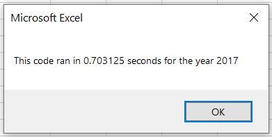
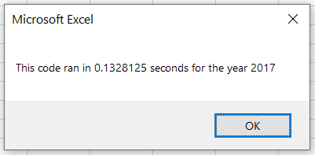
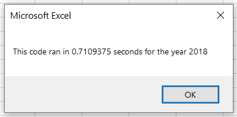

# Refactoring VBA Code for Stock Market Analysis

## Overview of Project

### Purpose
The purpose of this project to refactor our original VBA script to analyze much larger amounts of data in a more efficient manner. We will update our previously written code, intended for analyzing a small number of stocks over the course of a year, so that it can analyze a much larger number of stocks and return results at a faster speed. We will also incorporate the formatting code, originally written as a separate script, into our refactored script.

## Results
Our first version of the script utilized nested loops, where it would run through every single row of the data looking for a singular specified ticker, accumulating data for that ticker, displaying the results for that ticker, and then starting from the beginning again looking for the next ticker.  While this worked fine for a small dataset, we knew that when working with a larger dataset it would be more efficient to only go through the rows once and accumulate data for all the outputs simultaneously. For this to work we first needed to store our outputs in arrays instead as variables. 
```
    Dim tickerVolumes(12) As Long
    Dim tickerStartingValue(12) As Single
    Dim tickerEndingValue(12) As Single
```
We then set the variable tickerIndex to 0 and looped through each row of the dataset. First the code checks to see if the ticker matches the ticker in index position 0, if it does the Daily Volume is added to the Daily Volume Total array in index position 0. The code then checks to see if the row contains either the starting or ending price for the year for that specific ticker and updates the corresponding arrays accordingly. 
```
        If Cells(i, 1).Value = tickers(tickerIndex) Then
            tickerVolumes(tickerIndex) = tickerVolumes(tickerIndex) + Cells(i, 8).Value
        End If

        If Cells(i, 1).Value = tickers(tickerIndex) And Cells(i - 1, 1).Value <> tickers(tickerIndex) Then
            tickerStartingValue(tickerIndex) = Cells(i, 6).Value
        End If

        If Cells(i, 1).Value = tickers(tickerIndex) And Cells(i + 1, 1).Value <> tickers(tickerIndex) Then
            tickerEndingValue(tickerIndex) = Cells(i, 6).Value
        End If
```
If it is determined that the row contains the last incidence of the ticker in index position 0, the ticker index is then raised by 1 and we move on to the next row looking for the ticker at the next index position. 
```
        If Cells(i, 1).Value <> Cells(i + 1, 1).Value Then
            tickerIndex = tickerIndex + 1
        End If
```
Even when analyzing our smaller dataset, the difference in script runtime is significant (original script runtimes on left vs refactored script runtimes on right):

 vs. 

 vs. 

## Summary
The advantage of refactoring is that you can continually improve your code as your project or its scope change. Refactoring is better than scrapping the code entirely and starting from scratch because you are building on the foundation you already laid in your first attempt at the code, but possibly approaching it from a different angle. The changes you make are in efforts to make the code more elegant, streamlined, and efficient, and usually result in the enhancement of the code. The only disadvantage is that it may be time consuming and there is no guarantee it will work. However, there is always the option to revert to your original code should your refactoring not result in improved performance. 

In this specific project, while our original code was adequate for our relatively small data set, there was a more elegant approach to the code that improved its efficiency in analyzing larger datasets. This was clearly observed when comparing script run times for the original code to the refactored code. While there is no obvious disadvantage to our refactored script, further refactoring might be needed down the road as our current script works when the dataset is limited to only the tickers defined in our ticker array, and they are listed alphabetically and chronologically. 
